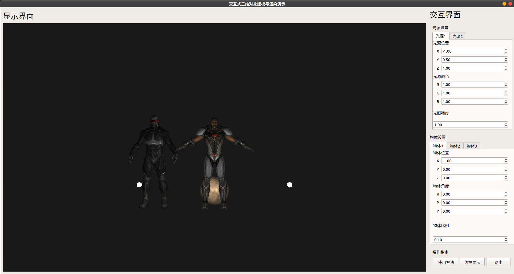

# 计算机图形学大作业

## 设计内容
设计一个交互式场景建模与绘制效果演示工具软件,实现三维物体的多边形网格建模与真实感渲染：
1. 包含三个以上物体,组成一个有意义的三维场景
2. 可任意选择不同图像用于不同对象的纹理映射
3. 可选择定义对象的不同凹凸纹理映射
4. 选择设置2个点光源,光源位置、方向和光照强度可分别改变

## 必要库
[Assimp]("https://github.com/assimp/assimp) 安装可以按照[Build Instructions]("https://github.com/assimp/assimp/blob/master/Build.md")进行

## 编译说明
我是在ubuntu环境下使用QT5.9.9的QT Creater进行编译。windows和MacOS不知道有没有兼容性问题。编译完成后把objects文件夹放入debug或release目录下即可。

## 运行界面
